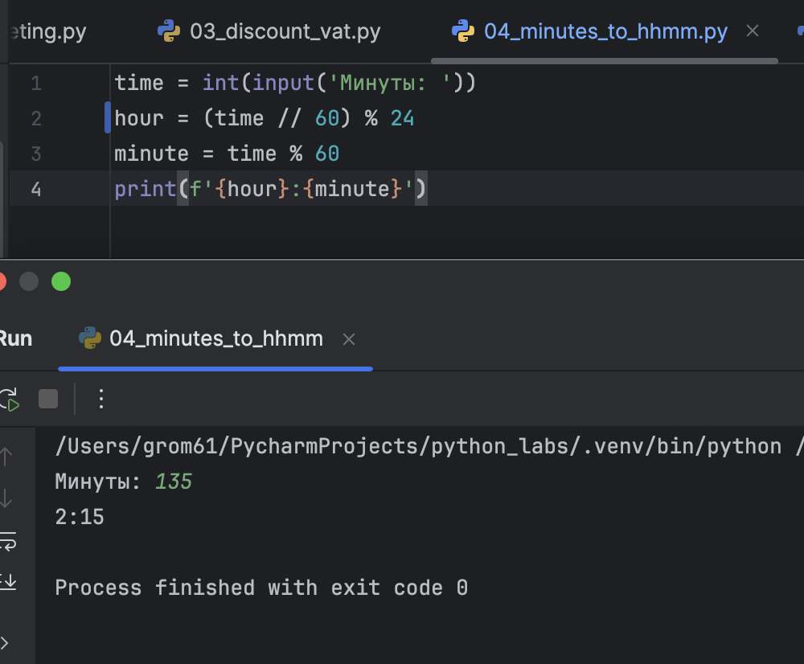

# python_labs
# Лабораторная работа 1

### Задание номер 1
```python
name = input('Имя: ')
age = int(input('Возраст: '))
print(f'Привет, {name}! Через год тебе будет {age + 1}.')
```


### Заданиет номер 2
```python
a = float(input('a: ').replace(',', '.'))
b = float(input('b: ').replace(',', '.'))
print(f'{a + b}; avg={round(((a + b)/2),2)}')
```


### Задание номер 3
```python
price = 1000
discount = 10
vat = 20
base = price * (1 - discount/100)
vat_amount = base * (vat/100)
total = base + vat_amount
print(f"База после скидки: {format(base,'.2f')}")
print(f'НДС: {format(vat_amount,'.2f')}')
print(f"Итого к оплате: {format(total,".2f")}")
```


### Задание номер 4
```python
time = int(input('Минуты: '))
hour = (time // 60) % 24
minute = time % 60
print(f'{hour}:{minute}')
```


### Задание номер 5
```python
a = input('ФИО: ').split()
print(f'Инициалы: {a[0][0] + a[1][0] + a[2][0]}.')
print(f'Длина (симоволов): {len(a[0]) + len(a[1]) + len(a[2]) + 2}')
```

