# python_labs
# Лабораторная работа 1

### Задание номер 1
```python
name = input('Имя: ')
age = int(input('Возраст: '))
print(f'Привет, {name}! Через год тебе будет {age + 1}.')
```
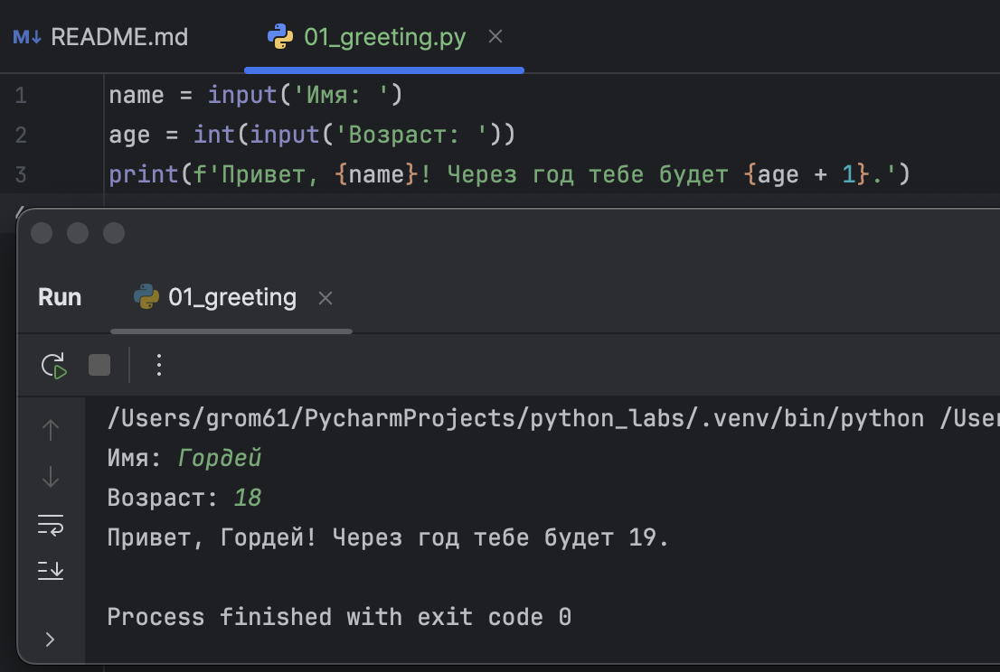


### Заданиет номер 2
```python
a = float(input('a: ').replace(',', '.'))
b = float(input('b: ').replace(',', '.'))
print(f'{a + b}; avg={round(((a + b)/2),2)}')
```
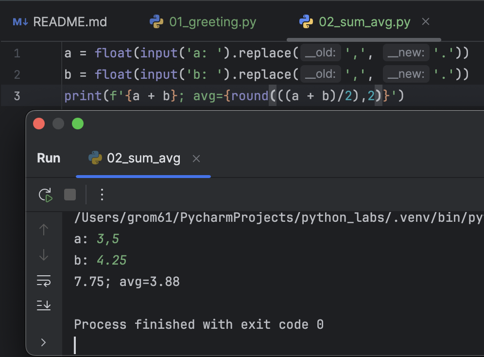

### Задание номер 3
```python
price = 1000
discount = 10
vat = 20
base = price * (1 - discount/100)
vat_amount = base * (vat/100)
total = base + vat_amount
print(f"База после скидки: {format(base,'.2f')}")
print(f'НДС: {format(vat_amount,'.2f')}')
print(f"Итого к оплате: {format(total,".2f")}")
```
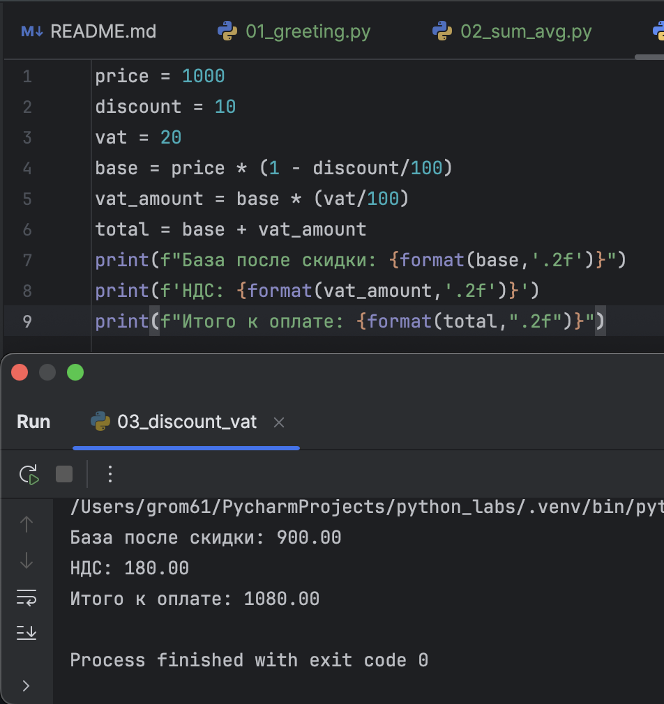

### Задание номер 4
```python
time = int(input('Минуты: '))
hour = (time // 60) % 24
minute = time % 60
print(f'{hour}:{minute}')
```
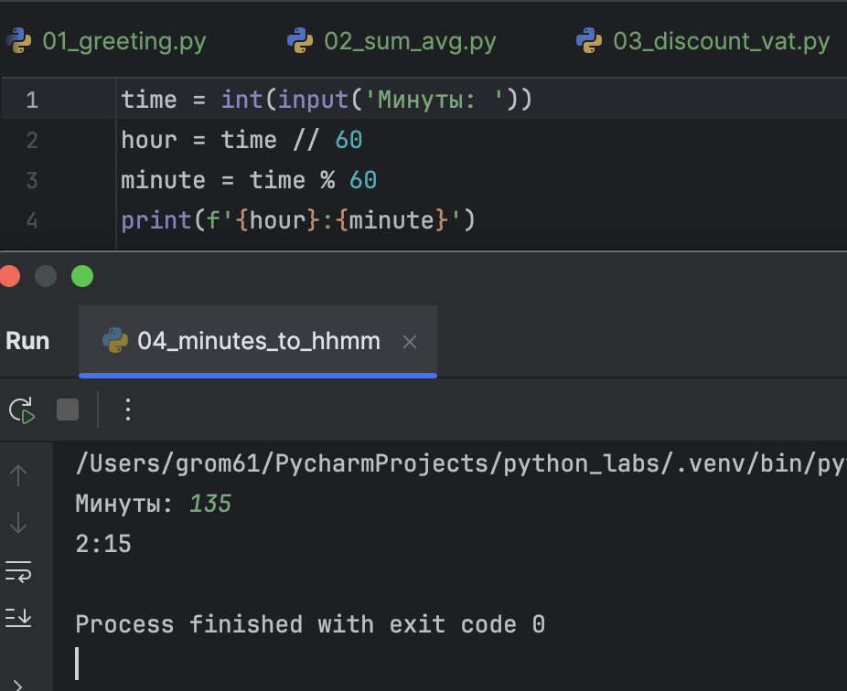

### Задание номер 5
```python
a = input('ФИО: ').split()
print(f'Инициалы: {a[0][0] + a[1][0] + a[2][0]}.')
print(f'Длина (симоволов): {len(a[0]) + len(a[1]) + len(a[2]) + 2}')
```
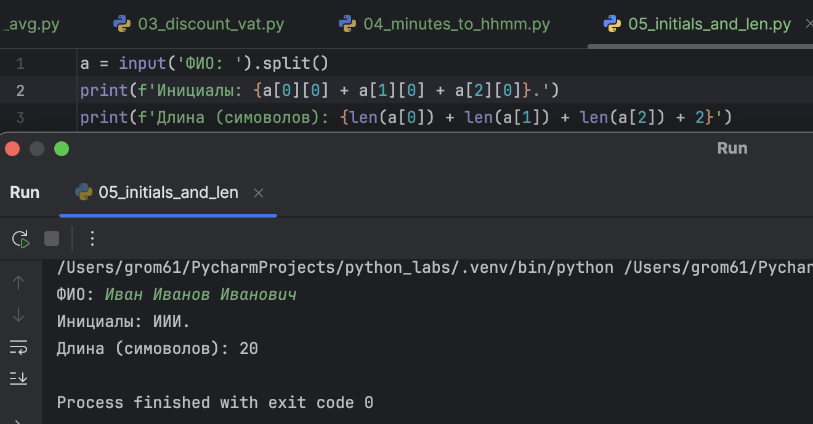

# Лабораторная работа 2

### Задание номер 1
```python
def min_max(a):
    if not a:
        raise ValueError("Список не может быть пустым")
    return (min(a), max(a))

def unique_sorted(a):
    return sorted(set(a))

def flatten(a):
    result = []
    for item in a:
        if not isinstance(item, (list, tuple)):
            raise TypeError(f"Элемент должен быть списком или кортежем, получен {type(item)}")
        result.extend(item)
    return result

print(min_max([3, 1, 2, 1, 3]))
```
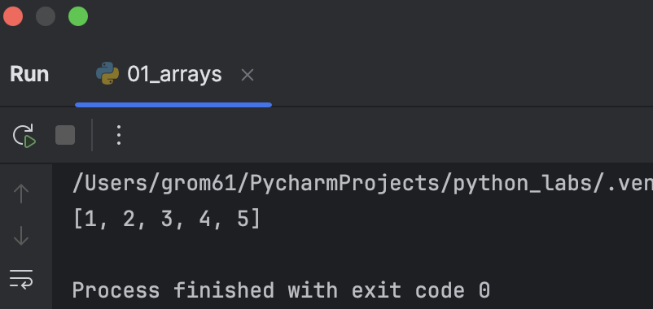
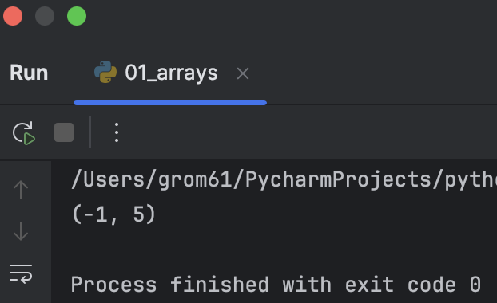
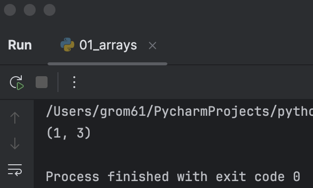

### Задание номер 2
```python
def transpose(a):
    result = []

    for i in range(len(a) - 1):
        if len(a[i]) < len(a[i + 1]) or (len(a[i]) > len(a[i + 1])):
            print('ValueError')
    
    for i in range(len(a[0])):
        new_list = []
        for k in range(len(a)):
            new_list.append(a[k][i])
        result.append(new_list)

    return result

def row_sums(a):
    sum_list = []

    for i in range(len(a)):
        summ = 0
        for k in (a[i]):
            summ += k
        sum_list.append(summ)
    return sum_list


def col_sums(a):
    sum_list = []

    for i in range(len(a[0])):
        summ = 0
        for k in range(len(a)):
            summ += a[k][i]
        sum_list.append(summ)

    return sum_list


print(row_sums([[1, 2, 3], [4, 5, 6]]))
```
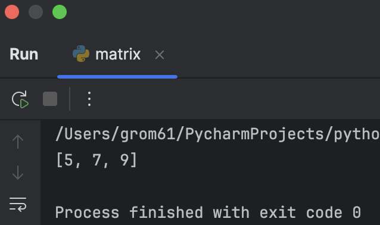
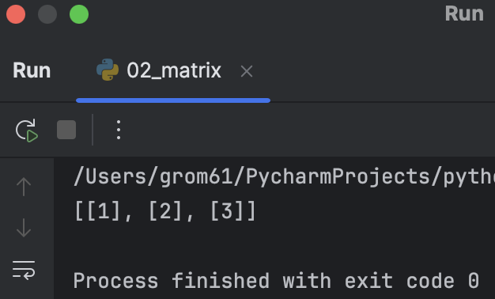
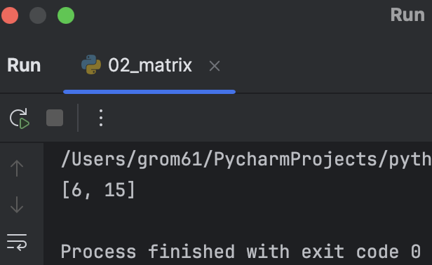

### Задание номер 3
```python
def format_record(a):
    fio_clean = a[0].strip()
    while "  " in fio_clean:
        fio_clean = fio_clean.replace('  ', ' ')
    FIO = fio_clean.split()

    if len(FIO) == 3:

        return f"{FIO[0]} {FIO[1][0]}.{FIO[2][0]}., гр. {a[1]}, GPA {round(a[2]):.2f} "
    elif len(FIO) == 2:
        return f"{FIO[0]} {FIO[1][0]}., гр. {a[1]}, GPA {round(a[2]):.2f}"
    else:
        return ('ValueError')


print(format_record(('    Громов     Гордей        Александрович    ', 'БИВТ-25', 3.49)))
```
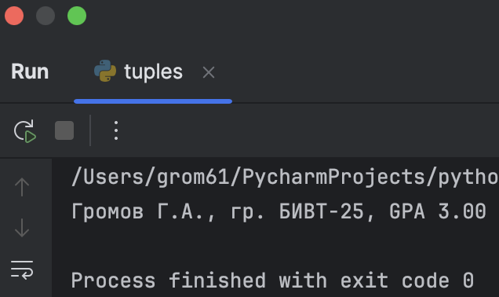

# Лабораторная работа 3
### Задание A

```python
from src.lib.text import *

print(normalize("ПрИвЕт\nМИр\t"))
print(normalize("ёжик, Ёлка", yo2e=True))
print(normalize("Hello\r\nWorld"))
print(normalize("  двойные   пробелы  "))

print(tokenize("привет мир"))
print(tokenize("hello,world!!!"))
print(tokenize("по-настоящему круто"))
print(tokenize("2025 год"))
print(tokenize("emoji 😀 не слово"))

print(top_n(count_freq(["a", "b", "a", "c", "b", "a"]), n=2))
print(top_n(count_freq(["bb", "aa", "bb", "aa", "cc"]), n=2))
```
```python
import sys
import os
sys.path.insert(0, os.path.abspath(os.path.join(os.path.dirname(__file__), '..', '..')))
from src.lib.text import*

text = sys.stdin.read()

textn = text

text = normalize(text)
text = tokenize(text)
textn = text
top = top_n(count_freq(text), n = 5)
text = top_n(count_freq(text))


print(f"Всего слов: {len(textn)}")
print(f"Уникальных слов: {len(text)}")
print("Топ-5:")
for word, count in top:
    print(f"{word}: {count}")
```
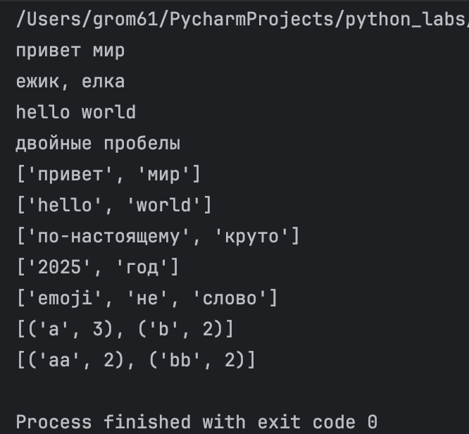
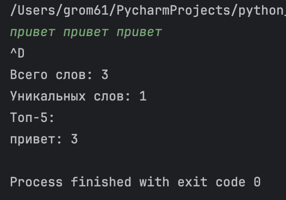

# Лабораторная работа 4
### Задание A

```python
import csv
from pathlib import Path
from typing import Iterable, Sequence


def read_text(path: str | Path, encording: str = "cp1251") -> str:
    p = Path(path)

    if p.exists() == False:
        raise FileNotFoundError

    if len(p.read_text(encoding=encording)) <= 0:
        return ''

    return p.read_text(encoding=encording)


def write_csv(rows: Iterable[Sequence], path: str | Path, header: tuple[str, ...] | None = None) -> None:
    p = Path(path)
    rows = list(rows)

    for i in range(len(rows) - 1):

        if len(rows[i]) != len(rows[i + 1]):
            raise ValueError

    with p.open("w", newline="", encoding="utf-8") as f:
        w = csv.writer(f)

        if header is not None:
            w.writerow(header)

        for r in rows:
            w.writerow(r)

```
```python
from src.lab04.io_txt_csv import *
from src.lib.text import *

b = read_text("/Users/grom61/PycharmProjects/python_labs/data/input.txt")
b = normalize(b)
b = tokenize(b)
b_ = b
b = count_freq(b)
top = top_n(b,5)
b = top_n(b)


write_csv(
    rows = b,
    path = "/Users/grom61/PycharmProjects/python_labs/data/report.csv",
    header=["Word","Count"]
)

print(f"Всего слов: {len(b_)}")
print(f"Уникальных слов: {len(b)}")
print("Топ-5:")
for word, count in top:
    print(f"{word}: {count}")
```
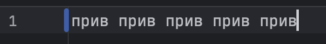
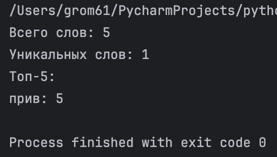
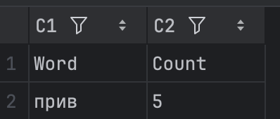
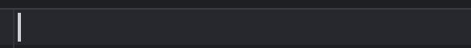
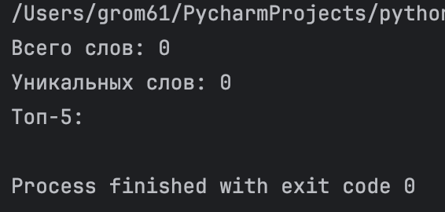
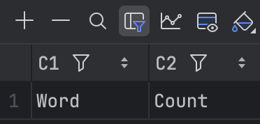
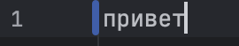
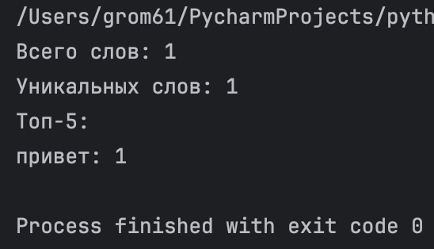
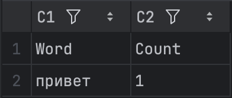

# Лабораторная работа 5
### Задание A
```python
import csv
import json
from pathlib import Path


def json_to_csv(json_path: str, csv_path: str) -> None:
    """
    Преобразует JSON-файл в CSV.
    Поддерживает список словарей [{...}, {...}], заполняет отсутствующие поля пустыми строками.
    Кодировка UTF-8. Порядок колонок — как в первом объекте или алфавитный.
    """

    json_path = Path(json_path)

    if json_path.exists() == False:
        raise FileNotFoundError

    if len(json_path.read_text(encoding="utf-8")) <= 0:
        raise ValueError

    with json_path.open("r", newline="", encoding='utf-8') as f:
        json_import = json.load(f)

    csv_path = Path(csv_path)

    with csv_path.open("w", newline="", encoding="utf-8") as f:
        csv_writer = csv.DictWriter(f, fieldnames=["name", 'age', 'city'])

        csv_writer.writeheader()
        csv_writer.writerows(json_import)


def csv_to_json(csv_path: str, json_path: str) -> None:
    json_path = Path(json_path)
    csv_path = Path(csv_path)

    if csv_path.exists() == False:
        raise FileNotFoundError

    if len(csv_path.read_text(encoding="utf-8")) <= 0:
        raise ValueError

    list_line_csv = []

    with csv_path.open('r', encoding='utf-8') as f:
        csv_read = csv.DictReader(f)
        for line in csv_read:
            list_line_csv.append(line)

    with json_path.open("w", newline='', encoding="utf-8") as f:
        json_writer = json.dump(list_line_csv, f, ensure_ascii=False, indent=2)

    """
    Преобразует CSV в JSON (список словарей).
    Заголовок обязателен, значения сохраняются как строки.
    json.dump(..., ensure_ascii=False, indent=2)
    """

json_to_csv("/Users/grom61/PycharmProjects/python_labs/data/samples/people.json",'/Users/grom61/PycharmProjects/python_labs/data/out/people_from_json.csv')
csv_to_json("/Users/grom61/PycharmProjects/python_labs/data/samples/people.csv",'/Users/grom61/PycharmProjects/python_labs/data/out/people_from_csv.json')
```
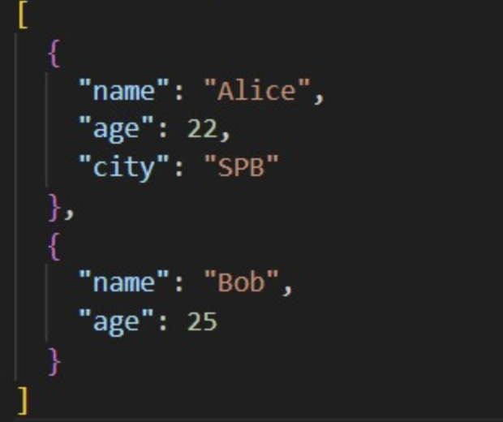
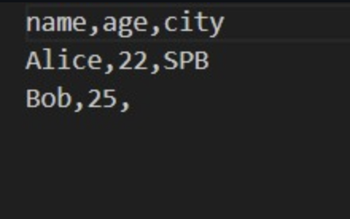

### Задание b
```python
import openpyxl
from pathlib import Path
import csv


def csv_to_xlsx(csv_path: str, xlsx_path: str) -> None:
    """
    Конвертирует CSV в XLSX.
    Использовать openpyxl ИЛИ xlsxwriter.
    Первая строка CSV — заголовок.
    Лист называется "Sheet1".
    Колонки — автоширина по длине текста (не менее 8 символов).
    """
    csv_path = Path(csv_path)
    xlsx_path = Path(xlsx_path)

    if csv_path.exists() == False:
        raise FileNotFoundError

    if len(csv_path.read_text(encoding="utf-8")) <= 0:
        return ""

    xlsx_book = openpyxl.Workbook()
    xlsx_sheet1 = xlsx_book.active
    xlsx_sheet1.title = "Sheet1"

    with csv_path.open('r', encoding='utf-8') as f:
        csv_read = csv.reader(f)

        for row in csv_read:
            xlsx_sheet1.append(row)

    xlsx_book.save(xlsx_path)


csv_to_xlsx("/Users/grom61/PycharmProjects/python_labs/data/samples/people.csv", "/Users/grom61/PycharmProjects/python_labs/data/out/people.xlsx")

```
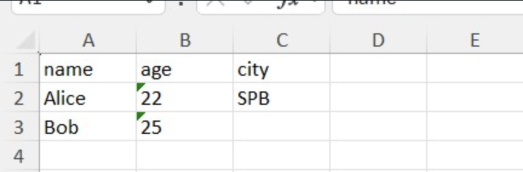
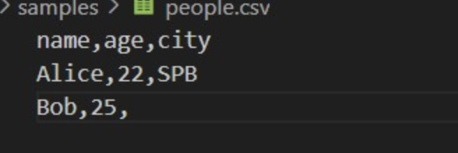

# Лабораторная работа 6
### Задание номер 1
```python
import argparse
from src.lib.text import count_freq, tokenize, normalize, top_n
from pathlib import Path

def main():
    parser = argparse.ArgumentParser(description="CLI‑утилиты лабораторной №6")
    subparsers = parser.add_subparsers(dest="command")

    cat_parser = subparsers.add_parser("cat", help="Вывести содержимое файла")
    cat_parser.add_argument("--input", required=True)
    cat_parser.add_argument("-n", action="store_true", help="Нумеровать строки")

    stats_parser = subparsers.add_parser("stats", help="Частоты слов")
    stats_parser.add_argument("--input", required=True)
    stats_parser.add_argument("--top", type=int, default=5)

    args = parser.parse_args()

    if args.command == "cat":
        """ Реализация команды cat """

        with Path(args.input).open("r", newline='', encoding = 'utf8') as f:
            people = f.read()
            list_p = people.split()

        count = 0

        if args.n:
            for peo in list_p:
                count += 1
                print(f"{count} {peo}")

        else:
            for peo in list_p:
                print(f"{peo}")

    elif args.command == "stats":
        """ Реализация команды stats """

        with Path(args.input).open("r", newline='', encoding = 'utf8') as f:
            people = f.read()

        final = top_n(count_freq(tokenize(normalize(people))), args.top)

        for word, count in final:
            print(f"{word}: {count}")
        
if __name__ == "__main__":
    main()
       
```
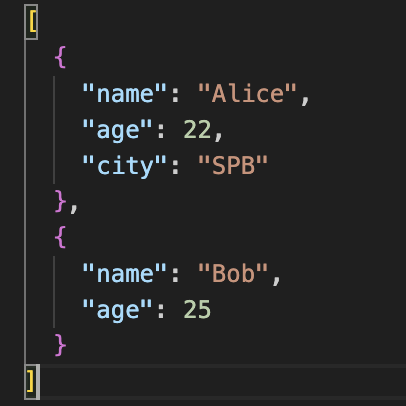
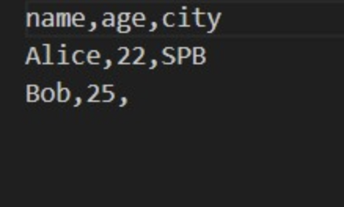
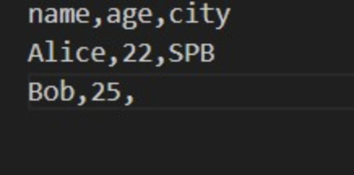
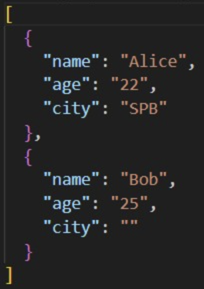

### Задание номер 2
```python
import argparse
from src.lab05.json_csv import json_to_csv, csv_to_json
from src.lab05.csv_xlsx import csv_to_xlsx
from pathlib import Path

def main():
    parser = argparse.ArgumentParser(description="Конвертеры данных")
    sub = parser.add_subparsers(dest="cmd")

    p1 = sub.add_parser("json2csv")
    p1.add_argument("--in", dest="input", required=True)
    p1.add_argument("--out", dest="output", required=True)

    p2 = sub.add_parser("csv2json")
    p2.add_argument("--in", dest="input", required=True)
    p2.add_argument("--out", dest="output", required=True)

    p3 = sub.add_parser("csv2xlsx")
    p3.add_argument("--in", dest="input", required=True)
    p3.add_argument("--out", dest="output", required=True)

    args = parser.parse_args()

    """
        Вызываем код в зависимости от аргументов.
    """

    if args.cmd == "json2csv":
        json_to_csv(Path(args.input),Path(args.output))

    elif args.cmd == "csv2json":
        csv_to_json(Path(args.input),Path(args.output))

    elif args.cmd == "csv2xlsx":
        csv_to_xlsx(Path(args.input),Path(args.output))

if __name__ == "__main__":
    main()
```
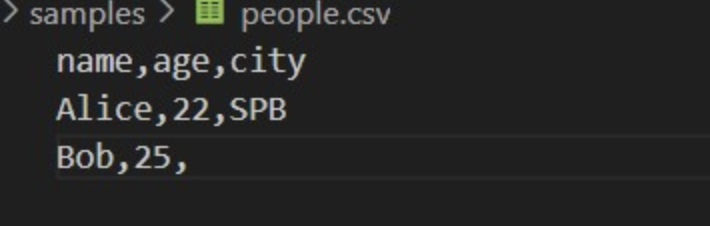
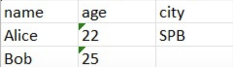

# Лабораторная работа 7
### Задание номер 1

```python
import pytest
from src.lib.text import normalize, tokenize, count_freq, top_n


@pytest.mark.parametrize(
    "source, expected",
    [
        ("ПрИвЕт\nМИр\t", "привет мир"),
        ("ёжик, Ёлка", "ежик, елка"),
        ("Hello\r\nWorld", "hello world"),
        ("  двойные   пробелы  ", "двойные пробелы"),
        ("", ""),
        ("\n\t\r", ""),
        ("    a    b    ", "a b"),
    ],
)
def test_normalize_basic(source, expected):
    assert normalize(source) == expected


@pytest.mark.parametrize(
    "source, expected",
    [
        ("привет мир", ["привет", "мир"]),
        ("hello,world!!!", ["hello", "world"]),
        ("по-настоящему круто", ["по-настоящему", "круто"]),
        ("2025 год", ["2025", "год"]),
        ("emoji 😀 не слово", ["emoji", "не", "слово"]),
        ("", []),
        ("\n\t\r", []),
    ],
)
def test_tokenize_basic(source, expected):
    assert tokenize(source) == expected


def test_count_freq_and_top_n():
    freq = count_freq(["a", "b", "a", "c", "b", "a"])
    assert freq == {"a": 3, "b": 2, "c": 1}
    assert top_n(freq, 2) == [("a", 3), ("b", 2)]
    freq = count_freq([])
    assert freq == {}
    freq = count_freq(["один"])
    assert freq == {"один": 1}


def test_top_n_tie_breaker():
    freq = count_freq(["bb", "aa", "bb", "aa", "cc"])
    assert top_n(freq, 2) == [("aa", 2), ("bb", 2)]
    freq = count_freq(["z", "y", "x"])
    assert top_n(freq, 2) == [("x", 1), ("y", 1)]
    freq = count_freq(["a", "b"])
    assert top_n(freq, 5) == [("a", 1), ("b", 1)]
```
### Задание номер 2
```python
import csv
import json
from pathlib import Path

import pytest

from src.lab05.json_csv import csv_to_json, json_to_csv


def write_json(path: Path, obj):
    path.write_text(json.dumps(obj, ensure_ascii=False, indent=2), encoding="utf-8")


def read_csv_rows(path: Path):
    with path.open(encoding="utf-8") as f:
        return list(csv.DictReader(f))


def test_json_to_csv_basic(tmp_path: Path):
    src = tmp_path / "people.json"
    dst = tmp_path / "people.csv"
    data = [{"name": "Alice", "age": 22}, {"name": "Bob", "age": 25}]
    write_json(src, data)
    json_to_csv(str(src), str(dst))
    rows = read_csv_rows(dst)
    assert len(rows) == 2
    assert set(rows[0]) >= {"name", "age"}


def test_json_to_csv_missing_fields(tmp_path: Path):
    src = tmp_path / "incomplete.json"
    dst = tmp_path / "incomplete.csv"
    data = [{"name": "Alice", "age": 22}, {"name": "Bob"}]
    write_json(src, data)
    json_to_csv(str(src), str(dst))
    rows = read_csv_rows(dst)
    assert len(rows) == 2
    assert "age" in rows[1]


def test_csv_to_json_basic(tmp_path: Path):
    src = tmp_path / "people.csv"
    dst = tmp_path / "people.json"
    src.write_text("name,age\nAlice,22\nBob,25\n", encoding="utf-8")
    csv_to_json(str(src), str(dst))
    obj = json.loads(dst.read_text(encoding="utf-8"))
    assert isinstance(obj, list) and len(obj) == 2
    assert set(obj[0]) == {"name", "age"}
    assert obj[0]["name"] == "Alice"


def test_csv_to_json_cyrillic(tmp_path: Path):
    src = tmp_path / "russian.csv"
    dst = tmp_path / "russian.json"
    src.write_text("имя,возраст\nАлиса,22\n", encoding="utf-8")
    csv_to_json(str(src), str(dst))
    obj = json.loads(dst.read_text(encoding="utf-8"))
    assert obj[0]["имя"] == "Алиса"


def test_json_to_csv_empty_raises(tmp_path: Path):
    src = tmp_path / "empty.json"
    src.write_text("[]", encoding="utf-8")
    with pytest.raises(ValueError):
        json_to_csv(str(src), str(tmp_path / "out.csv"))


def test_json_to_csv_invalid_raises(tmp_path: Path):
    src = tmp_path / "invalid.json"
    src.write_text("{bad}", encoding="utf-8")
    with pytest.raises(ValueError):
        json_to_csv(str(src), str(tmp_path / "out.csv"))


def test_csv_to_json_empty_raises(tmp_path: Path):
    src = tmp_path / "empty.csv"
    src.write_text("", encoding="utf-8")
    with pytest.raises(ValueError):
        csv_to_json(str(src), str(tmp_path / "out.json"))


def test_csv_to_json_no_data_raises(tmp_path: Path):
    src = tmp_path / "no_data.csv"
    src.write_text("name,age\n", encoding="utf-8")
    with pytest.raises(ValueError):
        csv_to_json(str(src), str(tmp_path / "out.json"))


def test_json_to_csv_missing_file_raises():
    with pytest.raises(FileNotFoundError):
        json_to_csv("nope.json", "out.csv")


def test_csv_to_json_missing_file_raises():
    with pytest.raises(FileNotFoundError):
        csv_to_json("nope.csv", "out.json")
```
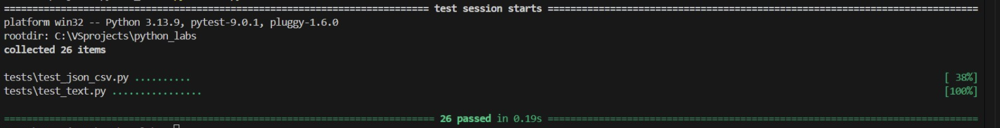
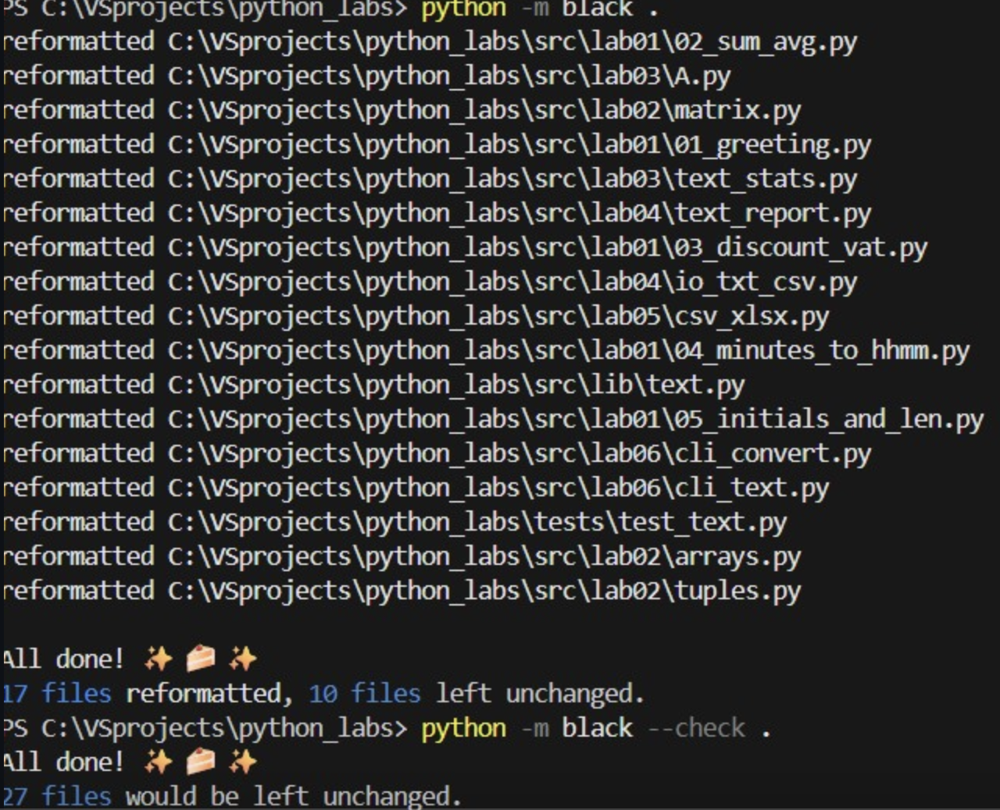

# Лабораторная работа 8
### Задания А
```python
from __future__ import annotations

from dataclasses import dataclass
from datetime import datetime, date
from typing import Any, Dict


@dataclass
class Student:
    fio: str          # ФИО студента
    birthdate: str    # формат YYYY-MM-DD
    group: str        # например, SE-01
    gpa: float        # 0.0–5.0

    def __post_init__(self) -> None:
        # Валидация даты
        try:
            datetime.strptime(self.birthdate, "%Y-%m-%d")
        except ValueError:
            raise ValueError(
                f"birthdate must be in format YYYY-MM-DD, got: {self.birthdate}"
            )

        # Валидация gpa
        if not (0.0 <= float(self.gpa) <= 5.0):
            raise ValueError("gpa must be between 0 and 5")

        self.gpa = float(self.gpa)

    def age(self) -> int:
        """Вернуть количество полных лет."""
        b = datetime.strptime(self.birthdate, "%Y-%m-%d").date()
        today = date.today()
        years = today.year - b.year
        if (today.month, today.day) < (b.month, b.day):
            years -= 1
        return years

    def to_dict(self) -> Dict[str, Any]:
        """Сериализация в словарь."""
        return {
            "fio": self.fio,
            "birthdate": self.birthdate,
            "group": self.group,
            "gpa": self.gpa,
        }

    @classmethod
    def from_dict(cls, data: Dict[str, Any]) -> "Student":
        """Десериализация из словаря."""
        return cls(
            fio=data["fio"],
            birthdate=data["birthdate"],
            group=data["group"],
            gpa=data["gpa"],
        )

    def __str__(self) -> str:
        """Красивый вывод."""
        return f"{self.fio} ({self.group}), GPA: {self.gpa}, возраст: {self.age()} лет"
from __future__ import annotations

from dataclasses import dataclass
from datetime import datetime, date
from typing import Any, Dict


@dataclass
class Student:
    fio: str          # ФИО студента
    birthdate: str    # формат YYYY-MM-DD
    group: str        # например, SE-01
    gpa: float        # 0.0–5.0

    def __post_init__(self) -> None:
        # Валидация даты
        try:
            datetime.strptime(self.birthdate, "%Y-%m-%d")
        except ValueError:
            raise ValueError(
                f"birthdate must be in format YYYY-MM-DD, got: {self.birthdate}"
            )

        # Валидация gpa
        if not (0.0 <= float(self.gpa) <= 5.0):
            raise ValueError("gpa must be between 0 and 5")

        self.gpa = float(self.gpa)

    def age(self) -> int:
        """Вернуть количество полных лет."""
        b = datetime.strptime(self.birthdate, "%Y-%m-%d").date()
        today = date.today()
        years = today.year - b.year
        if (today.month, today.day) < (b.month, b.day):
            years -= 1
        return years

    def to_dict(self) -> Dict[str, Any]:
        """Сериализация в словарь."""
        return {
            "fio": self.fio,
            "birthdate": self.birthdate,
            "group": self.group,
            "gpa": self.gpa,
        }

    @classmethod
    def from_dict(cls, data: Dict[str, Any]) -> "Student":
        """Десериализация из словаря."""
        return cls(
            fio=data["fio"],
            birthdate=data["birthdate"],
            group=data["group"],
            gpa=data["gpa"],
        )

    def __str__(self) -> str:
        """Красивый вывод."""
        return f"{self.fio} ({self.group}), GPA: {self.gpa}, возраст: {self.age()} лет"
```
### Задания B
```python
from __future__ import annotations

import json
from pathlib import Path
from typing import List

from .models import Student


def students_to_json(students: List[Student], path: str | Path) -> None:
    """
    Сохраняет список студентов в JSON-файл по указанному пути.
    """
    path = Path(path)
    data = [s.to_dict() for s in students]
    path.parent.mkdir(parents=True, exist_ok=True)
    with path.open("w", encoding="utf-8") as f:
        json.dump(data, f, ensure_ascii=False, indent=2)


def students_from_json(path: str | Path) -> List[Student]:
    """
    Читает JSON-массив, валидирует и возвращает список Student.
    """
    path = Path(path)
    with path.open("r", encoding="utf-8") as f:
        raw = json.load(f)

    if not isinstance(raw, list):
        raise ValueError("JSON must contain a list of students objects")

    students: List[Student] = []
    for item in raw:
        if not isinstance(item, dict):
            raise ValueError("Each student entry must be a JSON object")
        students.append(Student.from_dict(item))

    return students
```
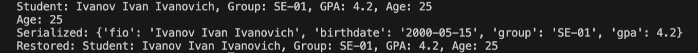
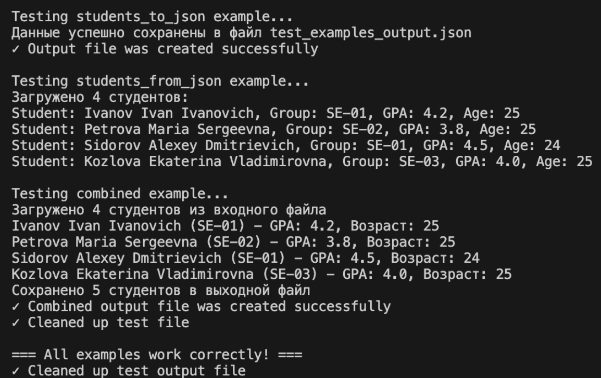
